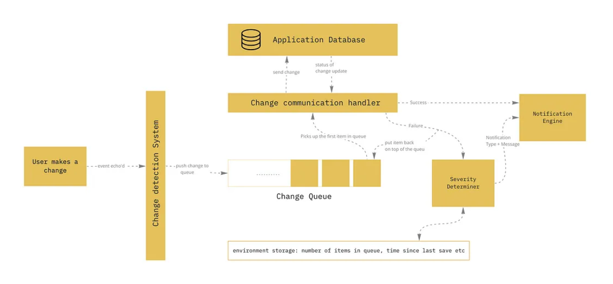

# Design Autosave Component

(because Jodi is a dumdum and need to hash this out on paper before code)

## Concepts related to autosave design

- eliminates the need for users to manually save their work by automatically saving changes periodically or in response to specific events
- autosave recent changes are consistently saved without interrupting the user's workflow
- trigger:
    - at regular intervals (e.g., every few minutes)
    - AND/OR triggered by events
- maybe a toggle to turn autosave on or off
- versioning since may want to revert to earlier history that isn't the most recent autosave
- expected user experience requirements:
    - operates in the background with minimal disruption to the user
    - not interfere with the user's primary tasks or introduce noticeable delays
    - optionally, give a subtle feedback, such as a brief message or indicator, can inform users that their changes are being autosaved
- reducing frequency of trigger:
    - need a debouncer to prevent excessive autosaving: some options are, delay autosave until a brief period of inactivity occurs
    - throttler instead of debouncer
- degradation or error management: something to prevent data loss in the case of failure
- performance impact assessment/concurrency issues

Related files
- [activity detector](activityDetector.js)
- [autosave](autosave.js)

Reference
- [Designing a user-friendly autosave functionality — Part 2](https://miro.medium.com/v2/resize:fit:1400/1*POnJo_s56v6SeWZhl9dCvQ.png)

